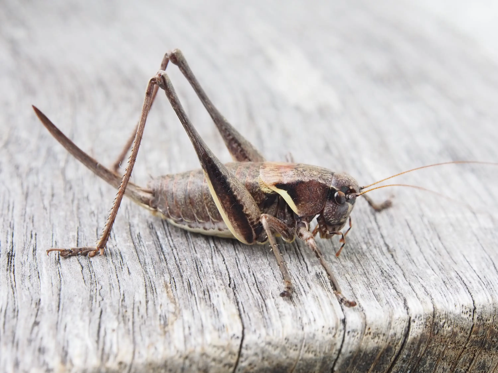

## About Me

I write C++, reverse engineer things, and occasionally bully Windows into revealing how it actually works.

Current interests:

- Windows kernel development
- NT internals
- Reverse engineering
- Security research
- Low-level tooling

You'll usually find me staring at:
- WinDbg
- IDA
- Process Hacker
- Documentation I should have read sooner

  

